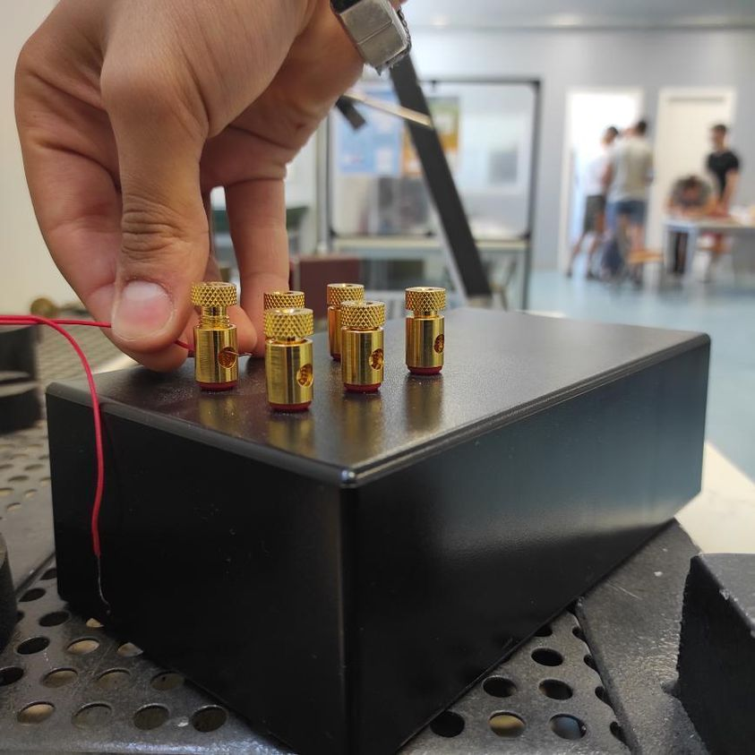
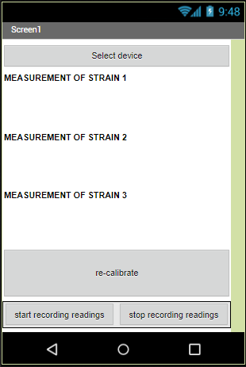
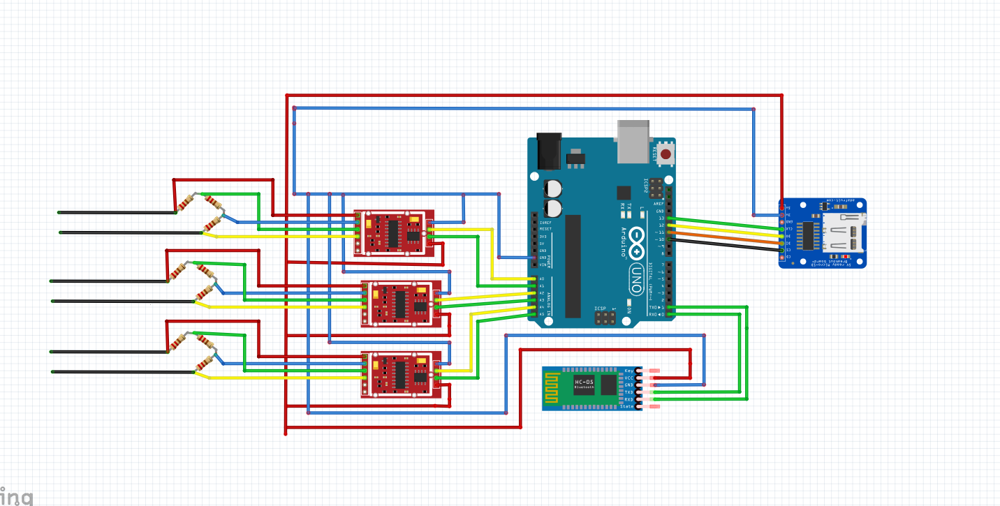
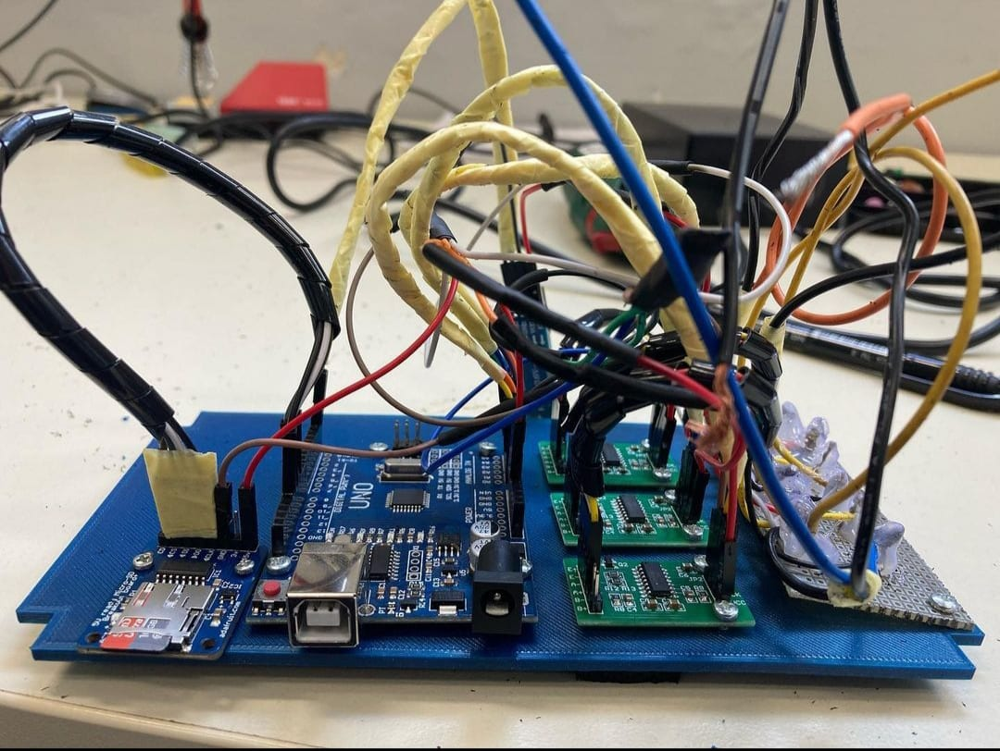

# Strain Measuring Device

YouTube Demo: https://www.youtube.com/shorts/gHfrUvlb1Ho

# Summary

This is my thesis project. The aim was to develop a strain measurement device with the ability to measure three strains simultaneously, save its measurements to an SD card, and be fully controlled by a smartphone.

# Prerequisites

* Arduino UNO
* HX711
* Adafruit SD card reader
* HC-05
* SD card
* Arduino IDE

# How to setup

1. Load the strain_measurement_device.ino code into the Arduino whithout having anything connected to it. 

2. Download the phone_application app to your android smartphone.

3. Wire the [circuit](#circuitry) as shown. 

This is a strain gauge measurement device. This device uses strain gauges in order to to measure strain. 

The device has three inputs and as a result, it can take 3 simultaneous readings.

The control of the device is being done using a phone application that connects to the device via Bluetooth.

The sensors that are used in this application are strain gauge resistors. They have a default resistance of 120 Ohm, a Gauge Factor of 2 ( GF = 2 ) and the device is built specifically for these sensors. The resistance of these sensors changes as they get stretched and as a result, we can use that change in resistance to measure the strain of the material. ([1](#straingauge))   

The device consists of 3 Wheatstone bridges, each of them has 3 120 Ohm resistors whith 0.1% tolerance (only resistors with tolerance <= 0.1% tolerance are 
acceptable for these applications). In every Wheatstone bridge the 4rth resistor is replaced by the strain gauge sensor which the user attaches to the test sample or 
structure being tested. As a result if the device is measuring 3 sensors there will be 3 complete Wheatstone bridges. What the Wheatstone bridges do is 
allowing us to measure very small resistance changes in the strain gauges. ([2](#wheatstone-bridge))

The resistance of the sensor changes and as a result, a change in the voltage ballance occurs in the wheatstone bridge which afterwards is passed through the HX711 amplifier and finaly its being read by the arduino. The arduino converts the voltage difference to strain and publishes it to the bluetooth application.

The user has 3 options while using the application. 

1) recalibrate: It recalibrates the device similar to the way you set a kitchen scale to zero. ex: we can place a load on our structure and have the device measure from that point as the start by recalibrating it after the load has been placed.
2) start recording readings: To start recording the measurements to the SD card that the device has.
3) stop recording readings to stop recording the measurements to the sd card.

# Circuitry

## mit app inventor blocks: 

# References

## StrainGauge
https://www.youtube.com/watch?v=z603U-Am3AY

## Wheatstone-Bridge
https://www.youtube.com/watch?v=ZqAM_wQ35ow

